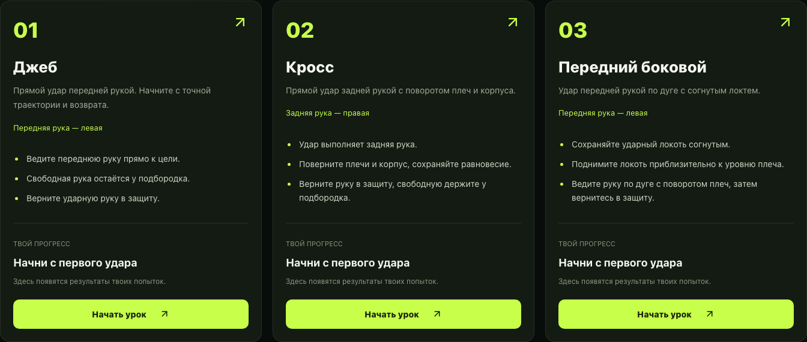
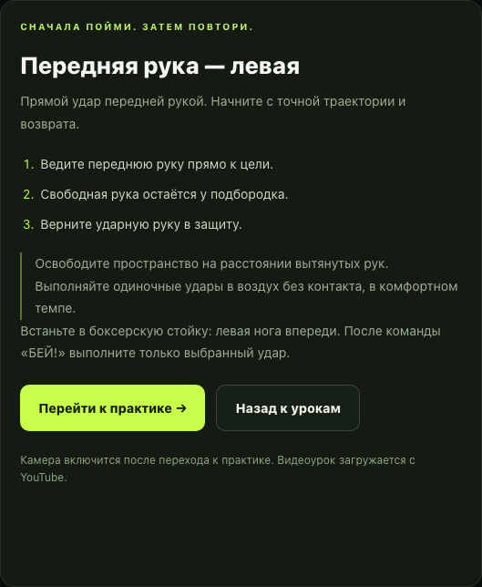
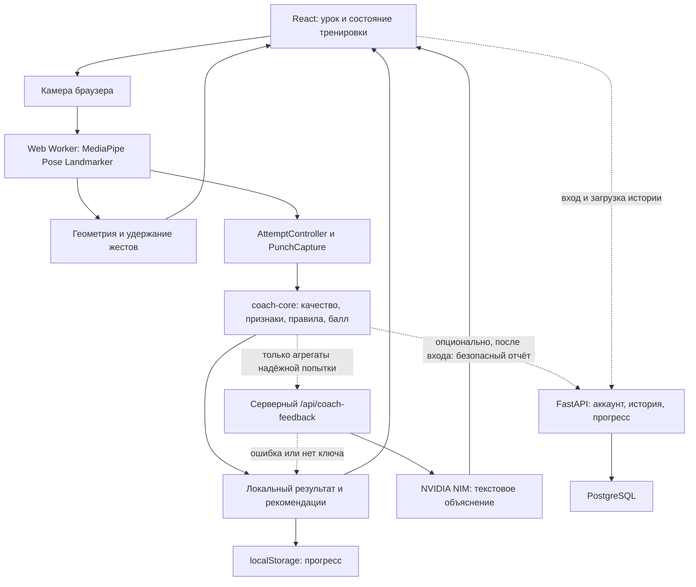

# ShadowCoach

**Камера — контроллер. Один удар — конкретная обратная связь.**

Браузерный образовательный AI-тренер по боксу: выберите стойку и удар, изучите технику, запустите попытку жестом и получите локальную оценку с рекомендациями.


[Быстрый запуск](#быстрый-запуск) · [Сценарий для жюри](#как-это-работает-для-пользователя) · [Режим ошибки](#режим-ошибки) · [Метрики](#метрики-на-видеодатасете) · [Проверки](#проверка-проекта)

**[Открыть приложение →](https://shadow-fight-unified.vercel.app/)**



**Admit Hackathon 2026 · Motion · B / FITNESS · команда NAN.** Для базовой тренировки не нужны аккаунт, FastAPI или NVIDIA API key. Ниже — воспроизводимый локальный запуск.

<details>
<summary>Оглавление</summary>

- [Что мы создали](#что-мы-создали)
- [Как это работает для пользователя](#как-это-работает-для-пользователя)
- [Управление движениями](#управление-движениями)
- [Режим ошибки](#режим-ошибки)
- [Результат Admit Hackathon](#результат-admit-hackathon)
- [Ключевые возможности](#ключевые-возможности)
- [Архитектура](#архитектура)
- [Технологии](#технологии)
- [Быстрый запуск](#быстрый-запуск)
- [Переменные окружения](#переменные-окружения)
- [Проверка проекта](#проверка-проекта)
- [Метрики на видеодатасете](#метрики-на-видеодатасете)
- [Структура проекта](#структура-проекта)
- [Приватность и безопасность](#приватность-и-безопасность)
- [Ограничения](#ограничения)
- [Команда и хакатон](#команда-и-хакатон)

</details>

## Что мы создали

Во время самостоятельной тренировки новичку сложно одновременно следить за ударной рукой, защитой и возвратом. Видеоурок объясняет движение, но не реагирует на конкретную попытку.

ShadowCoach объединяет урок, практику перед камерой и разбор одного удара. Направление кейса — **фитнес-тренер**: контроль измеримых признаков техники и личный прогресс. Вместо одного отображения скелета здесь есть законченный сценарий, собственные правила жестов, выделение попытки, проверка качества данных и конкретные замечания. Тип удара задаёт пользователь; система не классифицирует произвольные движения как любые виды ударов.

## Как это работает для пользователя

1. **Выберите стойку и урок.** Левая нога впереди — orthodox, правая — southpaw. Доступны джеб, кросс и передний боковой.
2. **Изучите технику.** Встроенный урок Tony Jeffries дополнен русскими инструкциями. Текст и переход к практике доступны даже при недоступном YouTube.
3. **Перейдите к практике и разрешите камеру.** Покажите голову, плечи, локти и обе кисти. Скелет и подсказки помогут расположиться в кадре; микрофон не запрашивается.
4. **Поднимите обе руки примерно на секунду.** Начнётся отсчёт 3 → 2 → 1. Опустите руки к подбородку и замрите: система должна зафиксировать защиту.
5. **После «БЕЙ!» выполните один выбранный удар и верните руку в защиту.** Подготовительные движения отделяются от оцениваемой попытки.
6. **Получите разбор.** При достаточных данных появятся балл 0–100, компоненты оценки и замечания. NVIDIA может дополнить их объяснением; при ненадёжных данных вместо балла показывается причина отказа.
7. **Повторите или завершите.** Поднятые руки запускают новую попытку, крест предплечьями возвращает к выбору удара. Надёжные оценки пополняют прогресс. Для жестов предусмотрены кнопочные альтернативы.

<details>
<summary>Текстовый урок и мобильный интерфейс</summary>



[Открыть скриншот мобильной версии](docs/readme/lessons-mobile.png). Это реальная вёрстка при ширине 390 px, не подтверждение производительности на физическом телефоне.

</details>

## Управление движениями

| Движение                        | Как распознаётся                                                                 | Действие приложения                                | Обратная связь                                            |
| ------------------------------- | -------------------------------------------------------------------------------- | -------------------------------------------------- | --------------------------------------------------------- |
| Обе руки вверх                  | Кисти выше головы, локти выше плеч; удержание около 0,95 с                       | Запуск или повтор попытки в разрешённых состояниях | Шкала удержания, отсчёт, приглашение зафиксировать защиту |
| Выбранный боксёрский удар       | Калибровка защиты, движение одной руки, подтверждение начала и завершения        | Одна попытка передаётся локальному оценщику        | Скелет, фаза движения, результат либо причина отказа      |
| Крест предплечьями перед грудью | Пересечение предплечий, кисти возле противоположных плеч; удержание около 1,35 с | Выход из практики к выбору удара                   | Шкала удержания, выключение камеры                        |

**Джеб** — прямой передней рукой; **кросс** — прямой задней рукой; **передний боковой (хук)** — передней рукой по дуге. Выбор руки зависит от стойки, а не от зеркального отображения камеры. Для бокового отдельно проверяются дуга, положение локтя и поворот плеч.

У жестов есть временное подтверждение, допуск коротких пропусков и защита от повторного срабатывания до выхода из позы. Во время отсчёта, калибровки и удара командные жесты не запускают новую попытку. Крест также отключён во время анализа; повтор поднятием рук разрешён при ожидании AI и отменяет прежний запрос.

Реализация: [геометрия жестов](apps/web/src/gestures), [машина состояний](apps/web/src/training/trainingMachine.ts), [захват удара](apps/web/src/training/punchCapture.ts).

## Режим ошибки

**Камера → MediaPipe landmarks → собственные геометрические и временные признаки → локальные правила ShadowCoach → конкретное замечание → AI-объяснение при доступности NVIDIA.**

MediaPipe оценивает ключевые точки, но не выставляет балл за бокс. `coach-core` нормализует координаты относительно плеч, сглаживает движение, находит фазы и вычисляет амплитуду, углы локтя, траекторию, положение свободной руки и возврат. [Локальные правила](packages/coach-core/src/evaluate.ts) определяют нарушения и балл; [конфигурация](shared/config/defaults.json) содержит пороги и веса.

| Замечание локального анализатора | Что предлагается изменить                                        |
| -------------------------------- | ---------------------------------------------------------------- |
| Свободная рука вне защиты        | Держать свободную руку ближе к подбородку                        |
| Нет возврата в защиту            | Вернуть ударную руку и задержаться в защите                      |
| Малая амплитуда                  | Выполнить более выраженное движение                              |
| Недостаточное разгибание         | Разгибать руку полнее, без жёсткой блокировки локтя              |
| Слишком прямой локоть на хуке    | Сохранять локоть согнутым                                        |
| Неверная рука                    | Джеб и передний боковой выполнять передней рукой, кросс — задней |

Это реализованные проверки, а не гарантия обнаружения каждой ошибки на любом видео. Для демонстрации выполните обычную попытку, затем намеренно измените один признак — например, возврат. Показывайте фактически выданный результат, включая возможный отказ от оценки.

**Ошибка техники и плохие данные — разные состояния.** Если кисть плохо видна, человек потерян, в кадре несколько людей или попытка неоднозначна, система объясняет проблему качества. Ненадёжная попытка не получает выдуманный балл, не улучшает среднюю оценку и не отправляется в NVIDIA.

**NVIDIA — объяснение, не оценщик.** Сервер получает ограниченный набор агрегатов и просит модель объяснить уже найденное замечание. Числовой балл остаётся локальным. Без ключа, при тайм-ауте, ошибке провайдера или невалидном ответе сохраняются локальный результат, рекомендации и возможность повтора. Проверка формата ответа не гарантирует правильность смысла AI-совета.

## Результат Admit Hackathon

Жюри оценило ShadowCoach в **87/100**. Проект не вошёл в финальный топ-15; в публичной таблице финалистов минимальный результат составил 95 баллов.

| Критерий               | Результат |
| ---------------------- | --------: |
| Работоспособность      |     26/30 |
| Режим ошибки           |     18/20 |
| Техническая реализация |     19/20 |
| UX и дизайн            |     12/15 |
| Оригинальность         |      8/10 |
| Бонусы                 |       4/5 |

Жюри отдельно отметило конкретную коррекцию ошибок и прозрачное описание точности в README. Основные ограничения демонстрации — нестабильное распознавание отдельных попыток, более слабый хук и длинный путь до практики. Эти замечания согласуются с опубликованными ниже метриками и используются как дальнейший план улучшений.

## Ключевые возможности

- Работа в браузере без установки приложения пользователем; отслеживание позы во время практики.
- Скелет и визуальная обратная связь. Оранжевые суставы относятся к последнему завершённому удару, а не к текущей позе.
- Три урока, две стойки, одна оценка на один пользовательский запуск; защита от устаревших результатов после повтора.
- Гостевой прогресс: количество надёжных попыток, последний, лучший и средний балл, основные ошибки.
- При подключённом FastAPI: регистрация, вход, история, серверный прогресс и повторная отправка временно не сохранённых отчётов.
- Адаптивная вёрстка, выбор передней или задней камеры, зеркальное отображение передней камеры и звук отсчёта при поддержке браузером. Проверка на реальных телефонах остаётся отдельной задачей.
- Видео и вычисление баллов остаются на устройстве. AI и аккаунт не обязательны для тренировки.

## Архитектура



Собственная работа проекта — правила жестов, временные фильтры, выделение границ удара, проверка измеримости признаков и локальное оценивание. Модель позы — готовая MediaPipe Full, не обученная командой нейросеть.

Worker обрабатывает один кадр за раз без накопления очереди. Подготовка и оценка разделены, а `attemptId` не даёт позднему ответу заменить новую попытку. Параметры оценщика общие для TypeScript и проверок Python-эталона. Подробности: [архитектура](docs/ARCHITECTURE.md), [выделение ударов](docs/PUNCH-CAPTURE.md), [backend](backend/README.md).

## Технологии

- **Frontend:** React 18, TypeScript, Vite, CSS/Tailwind CSS, Lucide React, Web Audio API.
- **Computer vision:** MediaPipe Tasks Vision 0.10.14, Pose Landmarker Full, WebAssembly, Web Worker, Canvas, `getUserMedia`.
- **Оценка техники:** TypeScript `coach-core`, геометрические и временные правила, общая JSON-конфигурация, Python-эталон.
- **Backend, опционально:** Python 3.12–3.14, FastAPI, SQLAlchemy, Alembic, PostgreSQL 17, JWT, Argon2. Docker-образ использует Python 3.13; тесты API — SQLite.
- **AI-пояснения, опционально:** NVIDIA NIM, серверный endpoint Node.js; модель по умолчанию `meta/llama-3.3-70b-instruct`.
- **Проверки:** Node.js Test Runner, Playwright, TypeScript, pytest, Ruff, сравнение с Python-эталоном и аудит production-файлов.

## Быстрый запуск

### Минимальная тренировка: только браузерное приложение

Нужны Git, npm и **Node.js не ниже 22.12.0**. Проверка этого README выполнена на Node.js **24.19.0**. Backend, Python, Docker, аккаунт и NVIDIA key для этого варианта не нужны.

```sh
git clone https://github.com/alikhrzh/Shadow-Fight.git
cd Shadow-Fight
npm ci
npm run model:download
npm run dev
```

Если репозиторий уже открыт, запускайте команды прямо из его корня. Откройте адрес, напечатанный Vite, обычно <http://127.0.0.1:5173>. При занятом порте будет выбран следующий.

`model:download` загружает официальную MediaPipe Full и проверяет SHA-256; уже корректная модель повторно не скачивается. `dev` подготавливает локальные WASM-файлы и worker. Модель не хранится в Git, поэтому пропуск шага загрузки на чистом клоне приведёт к ошибке подготовки ресурсов. Установка зависимостей, первая загрузка модели, YouTube и NVIDIA требуют сети.

**Камере нужен localhost или HTTPS.** Обычный HTTP по LAN-адресу компьютера на телефоне не подходит. Отсутствующий `/api/v1` означает недоступность аккаунта, а не запрет локальной тренировки. При недоступном AI остаются локальные подсказки.

### Полный запуск: FastAPI и PostgreSQL

Дополнительно нужны Docker и Docker Compose. Из корня репозитория, в первом терминале:

```sh
cd backend
docker compose up --build -d
docker compose ps
curl --fail http://127.0.0.1:8000/health/ready
```

Во втором терминале, снова из корня репозитория:

```sh
npm ci
npm run model:download
npm run dev
```

Compose поднимает PostgreSQL, применяет миграции Alembic и запускает API. Vite проксирует `/api/v1` на `127.0.0.1:8000`. Документация API — <http://127.0.0.1:8000/docs>. Если порты 8000 или 5173 заняты, проверьте запущенные сервисы; при изменении адресов согласуйте proxy и разрешённые origins.

Compose содержит **только development-настройки**. Для production нужны отдельные секреты, HTTPS, Secure-cookie и ограничения доступа. Запуск без Docker и полный API-контракт описаны в [backend/README.md](backend/README.md).

### NVIDIA и публикация

При необходимости создайте `.env.local` по [`.env.example`](.env.example), не перезаписывая существующий файл с настройками. Задайте ключ локально и перезапустите Vite. `npm run dev` обслуживает `/api/coach-feedback` серверным middleware; FastAPI не нужен для NVIDIA-пояснений.

Production-стенд доступен на **[shadow-fight-unified.vercel.app](https://shadow-fight-unified.vercel.app/)**. Vercel обслуживает frontend и `/api/coach-feedback`, а `/api/v1/*` проксирует на FastAPI в Render; серверная история хранится в PostgreSQL. Благодаря same-origin proxy `VITE_API_BASE_URL` в Vercel остаётся пустым, а refresh token хранится в Secure HttpOnly-cookie. Readiness backend можно проверить по адресу [`/health/ready`](https://shadow-fight-nc8t.onrender.com/health/ready).

После перехода на корневую структуру оставьте **Root Directory** в Vercel пустым. [vercel.json](vercel.json) задаёт загрузку модели, сборку, каталог `apps/web/dist` и адрес Render API; при создании другого backend обновите destination rewrite. NVIDIA-переменные задаются только на сервере. [Инструкция публикации](docs/DEPLOYMENT.md).

`npm run preview` показывает собранный интерфейс, но не запускает NVIDIA endpoint и не наследует dev-proxy FastAPI. Локальная тренировка при этом остаётся доступной. Free Render Web Service засыпает после периода без входящих запросов, поэтому первый вход или запрос истории после простоя может занять около минуты; перед демонстрацией откройте readiness endpoint. Free PostgreSQL рассчитан на временный стенд, истекает через 30 дней и не имеет backups.

## Переменные окружения

Основной файл — [`.env.example`](.env.example). Для минимальной тренировки все переменные можно не задавать.

| Переменная          | Назначение                                                                    |
| ------------------- | ----------------------------------------------------------------------------- |
| `NVIDIA_API_KEY`    | Серверный ключ NVIDIA; без него используется локальный разбор                 |
| `NVIDIA_MODEL`      | Модель пояснений, по умолчанию `meta/llama-3.3-70b-instruct`                  |
| `NVIDIA_BASE_URL`   | HTTPS endpoint провайдера, по умолчанию `https://integrate.api.nvidia.com/v1` |
| `VITE_API_BASE_URL` | Адрес FastAPI; пустой для same-origin и локального Vite proxy                 |

**Никогда не называйте NVIDIA key переменной с префиксом `VITE_`: такие значения доступны клиентской сборке.** Не коммитьте настоящие `.env` и не показывайте их при демонстрации.

Настройки FastAPI находятся в отдельном [`backend/.env.example`](backend/.env.example): `SHADOWCOACH_DATABASE_URL`, `SHADOWCOACH_JWT_SECRET`, `SHADOWCOACH_ENVIRONMENT`, `SHADOWCOACH_COOKIE_SECURE`, разрешённые hosts/origins и параметры сессий. Compose передаёт development-значения самостоятельно; в production их необходимо заменить.

## Проверка проекта

После установки зависимостей и модели, из корня репозитория:

```sh
npm test
npm run test:parity
npm run typecheck
npm run build
npx playwright install chromium
npm run test:browser
```

Backend, из корня репозитория, в отдельном Python-окружении:

```sh
cd backend
python3 -m venv .venv
. .venv/bin/activate
python -m pip install -e '.[dev]'
pytest
ruff check src tests alembic
```

**Фактически выполнено при подготовке README, 30.09.2026:** 272/272 теста Node.js, 142/142 сравнения с Python с допуском `1e-7`, 28/28 браузерных сценариев, TypeScript, production-сборка и аудит файлов — успешно. Backend: 5/5 тестов на временной SQLite и Ruff — успешно. Конфигурация Docker Compose проверена; полный PostgreSQL-контур в этом прогоне не поднимался.

Браузерные проверки используют искусственную камеру и тестовые ответы AI; отдельно запускается реальный MediaPipe worker. Физическая камера и настоящий NVIDIA-запрос не проверялись. Часть локальных тестов сохранённых видеозаписей явно пропускается на чистом клоне без приватных данных. Успешные тесты кода **не означают подтверждённую точность техники**.

Исторические эксперименты и ограничения: [TESTING.md](docs/TESTING.md). Материалы там относятся к указанным этапам разработки; результаты отдельного прогона на размеченном видеодатасете приведены ниже.

## Метрики на видеодатасете

**100 клипов · 3 вида ударов · 12 проверок техники.** Предсказания системы сопоставлены с экспертной разметкой. Выборка: 20 исходных видео одного участника, разделённых на 35 клипов джеба, 30 кросса и 35 переднего бокового. Стойка — левая нога впереди; зеркальность сохранённых оригиналов исправлена до обработки.

Главный результат — **micro-F1 51,9%** по обнаружению ошибок с учётом пропущенных попыток. Система выдала завершённую оценку для **55 из 100 клипов**: это покрытие оценкой, а не «точность 55%».

### Результаты по ударам

| Удар             |  Клипов | С завершённой оценкой | Precision | Recall с учётом пропусков | F1 с учётом пропусков |
| ---------------- | ------: | --------------------: | --------: | ------------------------: | --------------------: |
| Джеб             |      35 |       23 / 35 · 65,7% |     46,9% |                     57,7% |                 51,7% |
| Кросс            |      30 |       21 / 30 · 70,0% |     73,7% |                     70,0% |                 71,8% |
| Передний боковой |      35 |       11 / 35 · 31,4% |     33,3% |                     26,3% |                 29,4% |
| **Все удары**    | **100** |  **55 / 100 · 55,0%** | **51,5%** |                 **52,3%** |             **51,9%** |

Precision показывает, какая доля выданных замечаний подтверждается разметкой; recall — какую долю размеченных ошибок система нашла. F1 объединяет эти показатели. Для каждой строки ошибки суммируются по применимым проверкам (micro-average); это не точность классификации вида удара — упражнение задаётся заранее.

**Что показал прогон.** Лучше всего отработан кросс. Проверки неверной руки и недостаточного разгибания дают наиболее сильные результаты среди классов с положительными примерами. Главные направления улучшения — выделение попытки хука, ложные замечания о возврате и положении свободной руки.

<details>
<summary>Качество обнаружения каждого типа ошибки</summary>

Число примеров — количество клипов, где соответствующая ошибка отмечена в разметке. Один клип может содержать несколько ошибок.

| Ошибка                                | Положительных примеров | Precision | Recall с учётом пропусков | F1 с учётом пропусков |
| ------------------------------------- | ---------------------: | --------: | ------------------------: | --------------------: |
| Неверная рука                         |                     15 |    100,0% |                     73,3% |                 84,6% |
| Свободная рука вне защиты             |                      6 |     10,0% |                     16,7% |                 12,5% |
| Нет своевременного возврата           |                     14 |     33,3% |                     57,1% |                 42,1% |
| Малая амплитуда                       |                      6 |     50,0% |                     16,7% |                 25,0% |
| Недостаточное разгибание              |                     19 |     81,3% |                     68,4% |                 74,3% |
| Недостаточный поворот плеч            |                      0 |         — |                         — |                     — |
| Слишком разогнутый локоть на хуке     |                      3 |         — |                      0,0% |                  0,0% |
| Слишком согнутый локоть на хуке       |                      0 |         — |                         — |                     — |
| Слишком низкий локоть на хуке         |                      0 |      0,0% |                         — |                  0,0% |
| Непрямая траектория джеба             |                      0 |         — |                         — |                     — |
| Прямая траектория вместо дуги на хуке |                      2 |         — |                      0,0% |                  0,0% |
| Неподходящий темп                     |                      0 |      0,0% |                         — |                  0,0% |

«—» означает, что знаменатель равен нулю: показатель не определён. Если положительных примеров нет, чувствительность к этой ошибке не проверена; нулевой precision при этом означает наличие ложных замечаний, а не достаточность данных для оценки класса.

</details>

### Условия и границы проверки

- **Зафиксированный прогон:** 30.09.2026, версия оценщика и захвата **7be1894**, MediaPipe Full, последовательная обработка видео с частотой 30 кадров/с. Пороги под эти результаты не настраивались.
- **Проверяемый путь:** точки позы → калибровка защиты → выделение одной попытки → оценщик. Это воспроизведение записанных клипов через логику тренировки, не полный тест живой камеры; жесты запуска, отсчёт и NVIDIA в эти метрики не входят.
- **Учёт отказов:** 55 завершённых оценок, 9 ненадёжных результатов, 1 результат «нет попытки» и 35 клипов без отчёта. Размеченные ошибки в клипах без завершённой оценки считаются пропусками в recall и F1.
- **Контроль расчёта:** 34 верных замечания, 32 ложных и 31 пропущенная ошибка, из них 27 — в клипах без завершённой оценки. Precision = 34 / 66; recall = 34 / 65; F1 = 68 / 131. Агрегаты повторно сверены с результатами по каждому клипу.
- **Неопределённость разметки:** из 1 200 пар «клип × тип ошибки» 568 имеют определённую метку, 237 — неопределённую и 395 — «неприменимо». Последние две группы исключены из расчёта, а не превращены в отсутствие ошибки.
- **Диагностическое сравнение:** прямой анализ целого клипа без контроллера попытки дал 92 завершённых оценки, но micro-F1 лишь 26,6%. Большая доля выданных оценок сама по себе не означает лучшего качества.
- **Ограничение обобщения:** это небольшая внутренняя выборка одного участника, а не независимый многопользовательский benchmark. Результаты нельзя переносить на любые камеры, ракурсы и людей; качество числового балла 0–100 этим прогоном не валидировано.

## Структура проекта

```text
apps/web/                      React/Vite-интерфейс
  src/lessons/                 Уроки и инструкции
  src/gestures/                Геометрия управляющих жестов
  src/training/                Состояния и захват одной попытки
  src/feedback/, src/progress/ Разбор результата и локальный прогресс
packages/coach-core/           Признаки, проверки качества и оценщик
shared/                        Пороги, веса и общие контракты
api/coach-feedback.ts          Серверный endpoint NVIDIA
backend/                       FastAPI, PostgreSQL и миграции
tests/, browser-tests/         Модульные и пользовательские сценарии
scripts/                       Сборка ресурсов и диагностические команды
tools/python-reference/        Python-эталон для проверки логики
docs/                          Архитектура, тестирование и публикация
private-data/                  Локальные записи, исключённые из Git
```

Конфигурация npm, Vercel, TypeScript и Playwright находится в корне: дополнительный переход во вложенную рабочую папку не требуется.

## Приватность и безопасность

- **Камера:** кадры и landmarks обрабатываются локально и не отправляются на сервер. Приложение не записывает видео и не запрашивает микрофон. Выход из практики и скрытие вкладки останавливают камеру и worker.
- **AI:** передаются тип удара, стойка, локальный балл, компоненты, коды нарушений с выраженностью и агрегированные признаки: длительность, нормализованные расстояния/скорость, углы, показатели траектории, руки и возврата. Ни видео, ни координаты суставов, ни аккаунт в AI-payload не входят; состав ограничен [allowlist](apps/web/src/feedback/safePayload.ts).
- **Локальное хранение:** гостевой прогресс — агрегаты в `localStorage`, без видеозаписей. После входа временно не отправленные безопасные отчёты могут храниться в ограниченной очереди конкретного пользователя.
- **Аккаунт:** FastAPI хранит профиль и историю агрегированных отчётов, связанные с пользователем, а не анонимную видеобазу. Access token находится в памяти, refresh token — в HttpOnly-cookie, пароли хешируются Argon2. Удаление истории требует подтверждения.
- **Сервер NVIDIA:** проверяет Origin, размер и структуру запроса, ограничивает частоту обращений и время ожидания. Ключ и содержимое запросов не выводятся в логи. Лимит в памяти действует на один экземпляр сервиса и не заменяет production-защиту бюджета.
- **Внешний плеер:** на странице урока используется `youtube-nocookie.com`. Это отдельный сетевой сервис; видео с камеры ему не передаётся.

## Ограничения

- Одна RGB-камера не измеряет силу удара, нагрузку и точную 3D-биомеханику. Оценка основана на ограниченном наборе видимых признаков.
- Упражнение выбирается заранее. Поддерживаются одиночные удары на уровне головы, не комбинации, апперкоты и удары по корпусу.
- Ракурс, перекрытия рук, слабое освещение и низкий FPS могут приводить к пропускам или отказу от оценки. Очень слабый или нехарактерный хук может не пройти подтверждение дуги.
- Короткий клип без достаточной защиты до удара или без завершения после него не равен законченной живой попытке. Метрики захвата нельзя смешивать с точностью замечаний.
- Вёрстка проверена в мобильной эмуляции; работа физической камеры, нагрев и FPS на iPhone/Android требуют отдельной приёмки. Нет обещания совместимости со всеми браузерами и устройствами.
- Клиентские баллы подходят для личного прогресса, но не для защищённого соревновательного рейтинга. Для открытой регистрации нужны дополнительные меры, включая подтверждение почты и восстановление пароля.
- Приложение не заменяет тренера, не даёт медицинских рекомендаций и не гарантирует правильность техники или предотвращение травм. Практика — без контакта, в свободном пространстве и комфортном темпе.

## Команда и хакатон

**Admit Hackathon 2026 · кейс Motion · направление B / FITNESS.**

**Команда: NAN. Участники: Nursultan и Alikhan.**

По подтверждению команды, собственные заготовки, написанные до старта 28.09.2026, 07:00 по Астане, не использовались. Готовые сторонние компоненты, включая модель MediaPipe, перечислены в разделе технологий.

В Git первая фиксация — `a128fd2` от 29.09.2026, 17:48 (UTC+5). В проекте есть Python-эталон, на который опирается TypeScript-оценщик. Дата первого коммита сама по себе не доказывает время создания исходников. История сохранена; текущий README не утверждает, что все последующие изменения были готовы до дедлайна кейса.

**Репозиторий:** [github.com/alikhrzh/Shadow-Fight](https://github.com/alikhrzh/Shadow-Fight).
